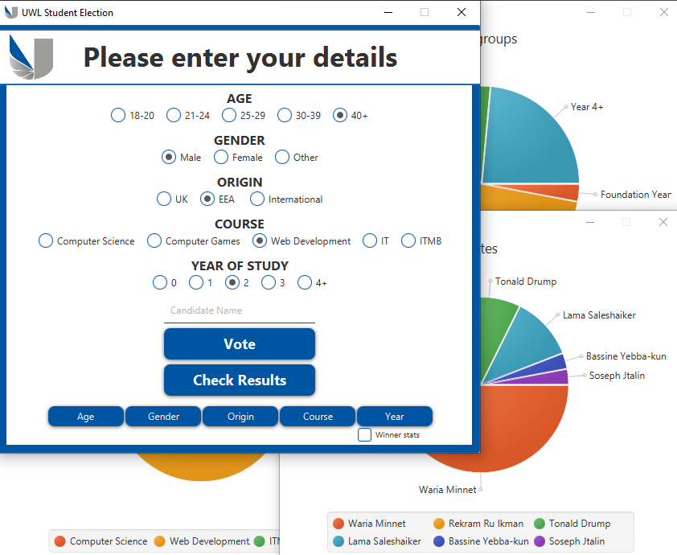

# ElectionAPP
---------------------------------------------------------------------------------------------
If the Program does not work please download "javafx-sdk-11.0" and add all the jar-files in
Javafx-sdk-11.0.2\lib\ to the global library.
VM options: --module-path %java path% --add-modules javafx.controls,javafx.fxml
---------------------------------------------------------------------------------------------

Basic Election Application with Graphical User Interface made in JavaFX. It allows the user to input candidate names in a text field
and register them by pressing the Vote button. If the name exists then it increments the vote count by 1.
The system collects user data that can be displayed to find more information about the users who voted
(eg. year/course). By ticking the checkbox you can exclusively isolate and analyze the groups that voted the
candidate with most votes. Clicking on the pie chart also displays the percentage of the data.

